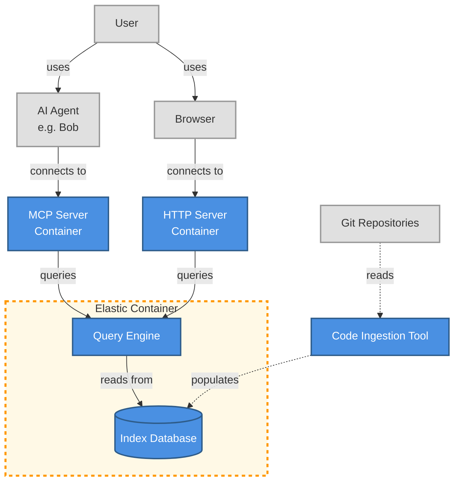

## Architecture

You have a set of code that needs indexing, which requires an ingestion tool. To achieve this, you will need to use the semantic code search indexer to fill the database. After that, the query engine can connect to the database using either the MCP or HTTP server to provide results to the user. This process can take place through an AI coding tool or directly to the user, via the servers.
