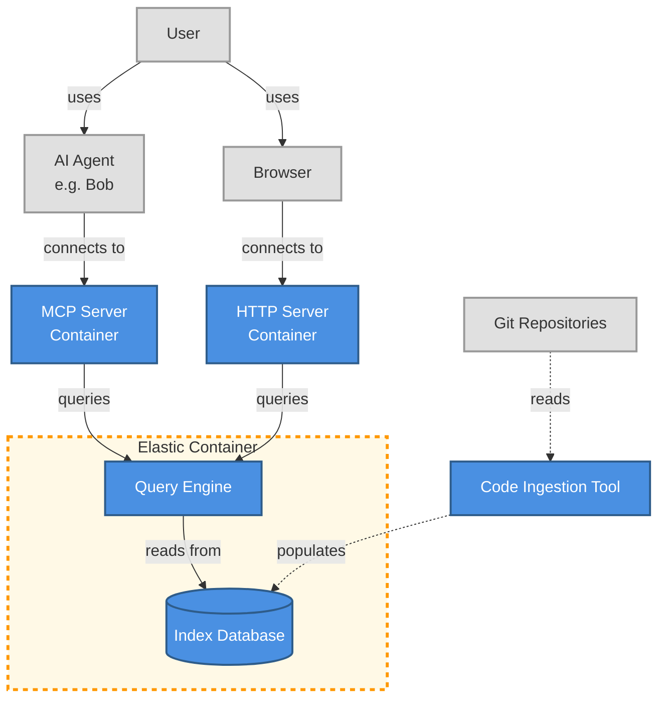

# Semantic Code Searcher


## Requirements
We need a system that can provide search results from our codebase that aren't a perfect match to our search term. 
### Minimum
- Semantic Search
- Index large codebases
- Multiple source codebases
- MCP API
- Containerised
- Language support:
  - C++
  - Java
  - Javascript
 
### Additional desired features
- [ ] Web UI
- [ ] Lanuage support:
  - [ ] Python
  - [ ] Bash
  - [ ] PL/1
  - [ ] Rust
  - [ ] Perl
- [ ] Scheduled indexing
- [ ] Triggered indexing


## Architecture



You have a set of code that needs indexing, which requires an ingestion tool. To achieve this, you will need to use the semantic code search indexer to fill the database. After that, the query engine can connect to the database using either the MCP or HTTP server to provide results to the user. This process can take place through an AI coding tool or directly to the user, via the servers.


## Manual Setup Steps

This document outlines the steps taken to set up the semantic code search infrastructure, including Elasticsearch deployment and code ingestion.

### 1. Acquire Machine and Install Prerequisites

Install required packages on the machine:

```bash
# Install Podman (container runtime)
sudo dnf install podman

# Install Node.js
sudo dnf install nodejs
```

Verify Node.js installation:
```bash
node -v
```

### 2. Deploy Elasticsearch with Docker/Podman

Following the [Elasticsearch Docker installation guide](https://www.elastic.co/docs/deploy-manage/deploy/self-managed/install-elasticsearch-docker-basic), we deployed Elasticsearch using Podman (Docker-compatible).

#### Create Docker Network
```bash
# Note: The exact command wasn't in bash history, but this is the standard approach
# from the Elasticsearch documentation
podman network create elastic
```

#### Start Elasticsearch Container
```bash
# Run Elasticsearch container with 1GB memory limit
# For machine learning features (like ELSER), use 6GB instead
podman run --name es01 --net elastic -p 9200:9200 -it -m 6GB -e "xpack.ml.use_auto_machine_memory_percent=true" docker.elastic.co/elasticsearch/elasticsearch:9.4.3

```

The command prints the `elastic` user password and enrollment token. Store the password as an environment variable:

```bash
export ELASTIC_PASSWORD="your_generated_password"
```

#### Extract SSL Certificate

Copy the SSL certificate from the container to the host machine:

```bash
sudo podman cp es01:/usr/share/elasticsearch/config/certs/http_ca.crt /home/amartens/http_ca.crt
sudo chmod a+r ${HOME}/http_ca.crt
```

#### Verify Elasticsearch is Running

Test the connection using curl:

```bash
# With certificate verification
curl --cacert ${HOME}/http_ca.crt -u elastic:$ELASTIC_PASSWORD https://localhost:9200

# Or skip certificate verification (not recommended for production)
curl -k -u elastic:$ELASTIC_PASSWORD https://localhost:9200
```

### 3. Trust the SSL Certificate System-Wide

To avoid needing to specify the certificate with every request, we added it to the system's trusted certificates. This follows guidance from [Baeldung's CA Certificate Management guide](https://www.baeldung.com/linux/ca-certificate-management).

```bash
# Install the certificate to the system trust store (Red Hat/Fedora)
sudo cp ${HOME}/http_ca.crt /etc/pki/ca-trust/source/anchors/
sudo update-ca-trust
```

After this, you can make requests without specifying the certificate:

```bash
curl -u elastic:$ELASTIC_PASSWORD https://localhost:9200
```

### 4. Set Up the Code Indexer

Clone the [semantic-code-search-indexer](https://github.com/elastic/semantic-code-search-indexer) repository:

```bash
cd ~/git
git clone https://github.com/elastic/semantic-code-search-indexer.git
cd semantic-code-search-indexer/
```

#### Pin to Stable Version

As noted in the indexer's README, the `main` branch may contain breaking changes. We pinned to a known-good commit from October 2025:

```bash
git checkout 2fe4a9a4fefe84252a9c5ffe95875162bdb79cd0
```

#### Install Dependencies and Build

```bash
npm install
npm run build
```

### 5. Index Code Repositories

With Elasticsearch running and the indexer built, index your code repositories:

```bash
# Index a repository with the --clean flag to start fresh
npm run index -- /path/to/your/repository --clean

# Examples from our setup:
npm run index -- ${HOME}$/git/axis-axis2-java-rampart/ --clean
```

The `--clean` flag removes any existing index data before indexing. Omit it for incremental updates.

### Notes

- The indexer uses environment variables for Elasticsearch connection. Ensure `ELASTIC_PASSWORD` is set.
- Because we have large repositories, we increased the Elasticsearch container memory (use `-m 6GB` instead of `-m 1GB`).
- The indexer respects `.gitignore` files and can use `.indexerignore` for additional exclusions.
- For production deployments, refer to the [indexer's README](https://github.com/elastic/semantic-code-search-indexer/blob/2fe4a9a4fefe84252a9c5ffe95875162bdb79cd0/README.md) for configuration options and best practices.

### References

- [Elasticsearch Docker Installation (Basic)](https://www.elastic.co/docs/deploy-manage/deploy/self-managed/install-elasticsearch-docker-basic)
- [Baeldung: CA Certificate Management on Linux](https://www.baeldung.com/linux/ca-certificate-management)
- [Semantic Code Search Indexer (GitHub)](https://github.com/elastic/semantic-code-search-indexer)
- [Indexer Documentation (pinned version)](https://github.com/elastic/semantic-code-search-indexer/blob/2fe4a9a4fefe84252a9c5ffe95875162bdb79cd0/README.md)

